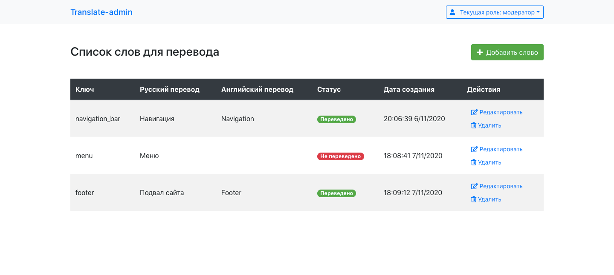
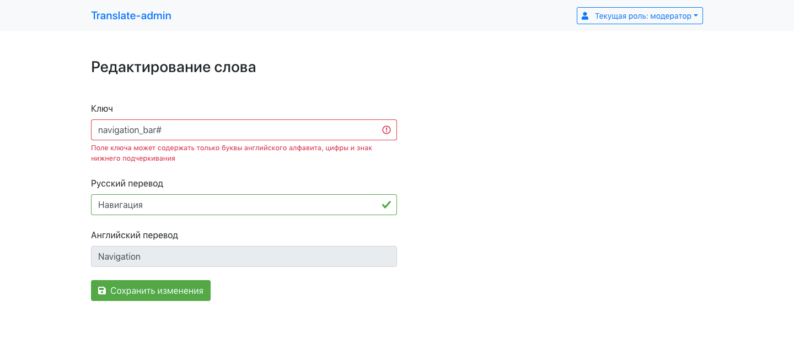

# Админ-панель для перевода слов

Данное приложение позволяет управлять переводами слов и будет полезно на мультиязычных сайтах. В админке предусмотрены две роли с разными правами редактирования, а так же возможность добавления слов и их удаления из базы.

Проект сделан при помощи JavaScript-библиотеки React и фрейморка Bootstrap. Для хранения данных используется Firebase. Управление состоянием данных осуществляется через библиотеку Redux.

##### Скриншот главной таблицы проекта



# Используемые технологии

- React 16
- Bootstrap 4
- JavaScript
- дополнительные npm-пакеты:
  * axios
  * redux
  * react-router-dom
 
# Возможности

- Разное поведение приложения для разных ролей
- Добавление нового слова в список для перевода с автоматическим заполнением даты и времени
- Редактирование и удаление слов из списка 
- Валидация полей в формах в режиме реального времени
- Переход между страницами без перезагрузки

##### Скриншот формы редактирования


# TODO
- [x] Таблица слов для перевода
- [x] Добавление / редактирование / удаление слов
- [x] Роли модератора и редактора
- [x] Валидация полей в формах
- [x] Хранение данных в Firebase
- [ ] Мобильная версия таблицы
- [ ] Loading на время загрузки данных из базы
- [ ] API Яндекс-переводчика
- [ ] Рефакторинг кода

# Демо/запуск проекта

Посмотреть можно по ссылке [https://mileor.github.io/translate-admin](https://mileor.github.io/translate-admin)

Чтобы запустить проект на своём компьютере — достаточно склонировать репозиторий и выполнить команды:
```
npm install
npm start
```
После введения команд готовый проект откроется в браузере автоматически.
